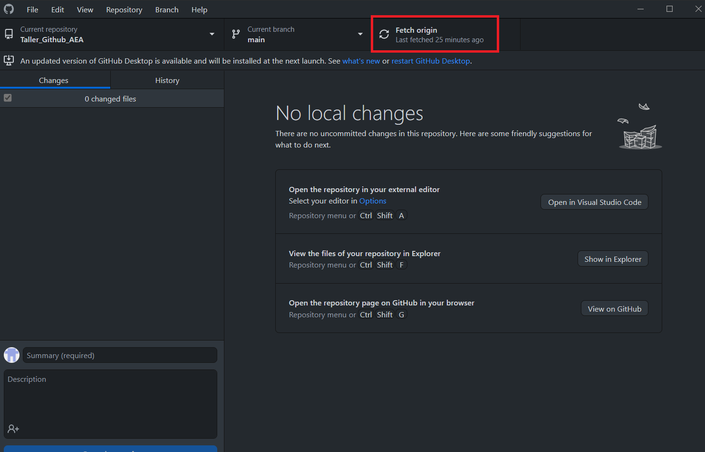

 

# Asamblea de Estudiantes de Economía
## Taller sobre Github
---

 

&nbsp;
## Primeros pasos:  [1](#myfootnote1)

### Antes de empezar, es importante tener en cuenta lo siguiente:

1. Asegúrese de tener una cuenta en Github. Si aún no cuenta con una, créela siguiendo las indicaciones del siguiente enlace: https://github.com/signup?source=login. Para crear su usuario, solo se admiten valores alfanuméricos y guion simple (-).

    

    Siga todos los pasos que le piden a continuación para poder iniciar sesión correctamente. La siguiente ventana que verá será:

     

    * (Dato adicional: si usa su email @pucp, puede postular a https://education.github.com/students para obtener una cuenta Pro)

       

2. Una vez que creada su cuenta, escriba su nombre de usuario en el siguiente Google Sheet: [aquí](https://docs.google.com/spreadsheets/d/1TluUMDJtxy7StmTufZVIM5qHmGwxS2hYRDTy3Hun71s/edit?usp=sharing).

3. Instale Github Desktop. En caso de que aún no lo tenga, vaya a https://desktop.github.com/ e instálelo. 
4. Inicie sesión en Github Desktop con su cuenta creada. 
5. Recibirá por correo una invitación de colaborador al repositorio del taller https://github.com/SandraMartinezGutierrez/Taller_Github_AEA

    

6. Finalmente, acepte la invitación al repositorio. 

    

7. Luego de haber completado estos pasos, usted será colaborador del repositorio.

    

### ¿Qué es un contributor? 

Es alguien que contribuye con los proyectos o tareas dentro de un repositorio (*repo*). Asimismo, entiende y sigue instrucciones del administrador del repo (*repo maintainer*). 

<a name="myfootnote1">1</a> Este material se basa fuertemente en los entrenamientos de [DIME](https://github.com/worldbank/dime-github-trainings), del Banco Mundial y materiales de clase de M.Sc. Alexander Quispe. 

&nbsp;
## USANDO GITHUB
---

## ¿Qué es Github?

- Github nos ayuda a solucionar el conocido problema del "Documento_Final.docx".

    

- Freste a esto, comúnmente, nuestra solución más rápida es llamar a nuestros documentos 
    - Paper_for_review_csu_200321.docx
    - Paper_for_review_csu_200321_ae_comments.docx
    - Paper_for_review_csu_200321_ae_comments_final.docx
    - Paper_for_review_csu_200321_ae_comments_final_v2.docx

- En este contexto, la ventaja de Github es que trackea cada edición hecha al documento. 

- Es un sitema de control de versiones Git. El control de versiones permite a los desarrolladores trabajar de forma segura a través de una **bifurcación** y una **fusión**. 

    - Con la **bifurcación**, un desarrollador duplica parte del código fuente (llamado repositorio). Este desarrollador, luego puede, de forma segura, hacer cambios a esa parte del código, sin afectar al resto del proyecto.
    - Luego, una vez que el desarrollador logre que su parte del código funcione de forma apropiada, esta persona podría **fusionar** este código al código fuente principal para hacerlo oficial.

Todos estos cambios luego son registrados y pueden ser revertidos si es necesario.

- En adición a esto, Github también ayuda a resolver los problemas de copia conflictiva, muy comunes en Dropbox; y también es posible conocer quiénes son o fueron los autores de documentos colgados en GitHub.

- GitHub es un sitio web y un servicio en la nube que ayuda a los desarrolladores a almacenar y administrar su código, al igual que llevar un registro y control de cualquier cambio sobre este código. 

- Github permite subir repositorios de código. Cada persona puede colaborar en proyectos de código, y el sistema de Github es código abierto por defecto, lo que significa que cualquiera en el mundo puede encontrar nuestro código en GitHub, usarlo, aprender de él, y mejorarlo.

&nbsp;

Hay 3 conceptos importantes a manejar: 

## 1. Clone (clonar)
___

### ¿Qué es un repositorio?

- Un repositorio es la ubicación o ruta en la que se almacena toda la información de un proyecto como imágenes, código, carpetas, documentos, etc.
- Cada proyecto contaría con su propio repositorio único, por lo que la ruta de acceso será exclusiva para el proyecto.

    
&nbsp;

### ¿Cómo crear un repositorio?

1. Primero, haga click en nuestra foto de perfil, ubicada en el lado superior derecho. Luego, dé click en "*Your repositories*".

     

2. Ahora, dé click en el botón verde *New*.

     

3. A continuación, aparecerá la siguiente ventana. Coloque un nombre a su repositorio. Puede configurar su repositorio como público o privado. Seleccione "*Add a README file*" para poder escribrir una descripción del proyecto que desee. Finalmente, seleccione "*Create repository*".

     

4. Finalmente, habrá creado su primer repositorio.

     

    
&nbsp;

### ¿Cómo clonar un repo?

Clonar es similar a descargar un repositorio. 
La diferencia entre clonar y descargar es que **Github recuerda de dónde descargamos el repositorio**. Esto es necesario para saber a dónde mandar nuestros cambios cuando seamos contributors. 

1. Ve a https://github.com/SandraMartinezGutierrez/Taller_Github_AEA
2. Haz click en el botón verde que dice *Code*

     

3. Haz click en *Open with Github Desktop*

     

4. Si aparece este mensaje en su navegador, haga click en *Abrir*

     

4. Inmediatamente después, será redirigido a la aplicación de escritorio de Github Desktop. Le aparecerá la siguiente ventana. Haga click en *Choose* y seleccione la ubicación en su computadora en donde desee clonar el repositorio. (**NO lo clone en una carpeta compartida de Dropbox, Box, Google Drive, etc.**) 

     

6. Finalmente, haga click en el botón azul *Clone* y ya habrá clonado el respositorio del taller en su computadora. Ahora ya podrá acceder a los archivos y contribuir en el repo.  

     

7. La vista que tendrá en el GitHub Desktop será la siguiente: 

    * Verificamos que estamos en el repositorio correcto:
        * Current repository: **Taller_Github_AEA**
        * Current branch: **main**
        * **Fetch origin**: Last fetched ***** (se recomienda hacer click en fetch origin antes y después de contribuir en el repo. Es una forma de "Actualizar" las nuevas modificaciones hechas en el repo.)
         

             

&nbsp;
## 2. Commit 
___

- ¿Qué es un control de versiones? 

    Todas las versiones de un documento en Google Doc están almacenadas. Así, se pueden ver la cantidad de modificaciones que hizo cada contribuidor al documento, y la fecha y hora de registro.

     

    Ahora bien, para no tener que almacenar todas estas versiones, Git usa los ***commits*** para indicar las diferencias significativas entre versión y versión.

    Cada commit funciona como una captura de los archivos del proyecto en determinado momento, y lo compara respecto al commit anterior. Además, cada commit tiene un timestamp (dentro de este ya tiene un id que incluye fecha y hora). Es una forma de “guardar” un archivo.

    Un commit en Github Desktop se ve así:

     

    En el lado izquierdo vemos los cambios realizados. Las cruces verdes significan que estamos añadiendo archivos al repositorio. El punto amarillo significa que estamos agregando un archivo que aún tenemos abierto en nuestra camputadora. Si hubiera algún signo negativo coloreado de rojo, significa que estamos eliminando archivos del repositorio.
    
    Para poder realizar un commit correctamente, debemos escribir una breve descripción en *Summary*, para que el botón *Commit to __branch__* se active.

    En el lado derecho vemos líneas de código. Vemos una primera línea sombreada de color color, mientras que las demás líneas están coloreadas de color verde. Esta diferenciación de colores se debe a dos motivos: quitando o modificando líneas de código existentes (rojo), o agregando nuevas líneas de código (verde).

    Ahora, le damos click en *Push Origin* para subir nuestros cambios al repositorio remoto de nuestro branch.

    

&nbsp;
## 3. Branch 
---

- Los branches son la propiedad más interesante de Git. Esto hace a Git una herramienta poderosa de colaboración y no solo de control de versiones.

- Los branches **permiten crear una copia del código donde puedes experimentar/jugar** con él. Si te gusta el resultado, **puedes mergear el experimento a la versión principal (main branch)**.

- En el caso de que queramos trabajar una parte concreta de nuestro proyecto de forma aislada no afectando al repositorio principal, tendremos que hacerlo mediante un branch.

- El branch creará una copia exacta de nuestro proyecto para hacer pruebas sin miedo a equivocarnos y que afecte a todo el trabajo realizado.

- Esta versión no-lineal es más fidedigna a cómo se trabaja en la vida real. 

     

 

## Explorando branches

¿Cual es la versión clonada en tu computadora? Cuando se clona un repo **todas las versiones** son clonadas, pero **solo una** es la que se muestra en nuestra carpeta. 

Un flujo de trabajo típico en Git implica tener varias ramas (branches). Hay otras herramientas en Github que vuelven a este flujo de trabajo muy manejable; sin embargo, está fuera del alcance de los propósitos del curso.

 

## Creando un branch

- Ve a https://github.com/SandraMartinezGutierrez/Taller_Github_AEA, y haz click al botón que dice *(símbolo branch) main*. **Asegúrese que sea el main.**

     

- Cree su branch llamado "nombre_apellido" en el cuadro de diálogo y dale click a lo encerrado en rojo para crear la rama. 

     

- Como último paso, vayamos a Github Desktop, y ubiquémonos en el branch en hemos creado. Para esto, sigamos los siguientes pasos:

    * Primero demos click en **Fetch Origin**, para actualizar el repositorio.

         
    
    * Luego, vayamos a *Current branch*, y demos click en la flecha derecha para abrir un desplegable en donde podremos ver una lista con los branches creados hasta el momento en el que dimos *Fetch Origin*.

         

    * Elijamos el branch que hemos creado recientemente.

         

    * Finalmente, sabremos que estamos ubicados en el branch correcto cuando nuestro *Current branch* se haya actualizado.

         
    
    
- ¡Ahora ya puedes realizar modificaciones al repo de forma independiente!

 

### Pull requests 

Una propiedad adicional a los branches es el **pull request**.
Cuando las ediciones realizadas están listas para ser mergeadas con el *main*, puedes hacer un pull request, lo cual integrará tus ediciones (*commits*) en la rama *main*. 

Es común que el acceso a la rama *main* solo la tenga el repo maintainer (no todos los contribuidores).
 
- Una vez ubicados correctamente en nuestro branch en Github Desktop, y luego de haber hecho nuestro primer *commit* al repositorio, haga click en **Create Pull request** para almacenar nuestros futuros *commits* en una línea temporal. Siguiendo el ejemplo hecho en nuestro apartado sobre el *Commit*, retomemos. Habiendo dado commit a nuestro branch, y luego de haberle dado click a *Push Origin* para subir nuestros cambios a nuestro repositorio remoto: 

     

    Ahora le damos click a *Pull Request*. 

     

    Esto nos redirigirá a nuestro navegador. Damos click a *Create Pull Request*.

     

    Una vez que ya hemos realizado cuantos commits sean necesarios para nuestro proyecto, le damos click a *Merge pull request*.

     

    Confirmamos esta acción dando click a *Confirm merge*.

     

    Finalmente, una forma ordenada que se sugiere al trabajar en Github es eliminar nuestros branches luego de hacer un merge. Para esto, seleccionamos *Delete branch*.

     

- Otra forma de hacer un *pull request* es yendo a https://github.com/SandraMartinezGutierrez/Taller_Github_AEA/pulls y darle click a *New pull request*.

     

- Asegúrese de que la branch *main* esté seleccionada como *base:* branch. Selecciona tu branch como *compare:* branch

     

- Scrollea para ver que tus ediciones son las que quieres que se integren con la main branch. Finalmente, dale click a *Create pull request*

 

### Aprender Github desde el command line: 

- En este tutorial, hemos lo visto los elementos esenciales para utilizar Github,; sin embargo, hay una forma de usar Github desde la consola. Aquí hay una lista de referencias en caso desee explorar más sobre este uso: https://education.github.com/git-cheat-sheet-education.pdf

